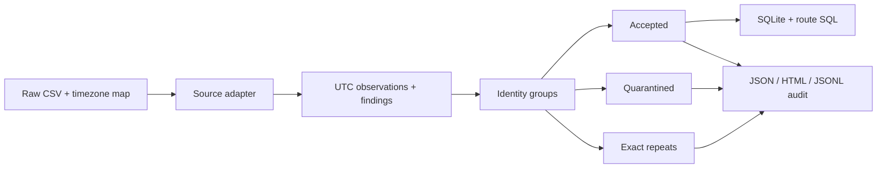

<div align="center">


# FlightOps Quality

**Explainable data quality for civil aviation ETL.**

[](pyproject.toml)
[](LICENSE)
[](https://github.com/ubeydgencer/flightops-quality/releases/tag/v0.1.1)
[](pyproject.toml)

[Quickstart](#quickstart) · [Data contract](#data-contract) · [Rules](docs/rules.md) · [Security](SECURITY.md) · [Validation](docs/validation.md) · [Türkçe](docs/portfolio-tr.md)

</div>

Turn local flight clocks and messy source records into UTC observations,
explainable findings and auditable metrics. Designed as a small Python layer
between raw operational data and an analytics warehouse.

> **Batch alpha.** All bundled flights are synthetic. Independent project;
> no airline affiliation, production deployment or standards certification.

## What it handles

| Data problem | Package behavior |
|---|---|
| Midnight, timezones and DST | Resolve explicit instants; report gaps/folds; require a policy for scheduled BTS `2400`. |
| Gate versus runway times | Preserve separate block, take-off and landing timestamps and metrics. |
| Cancellation and diversion | Retain the rows and distinguish their expected null arrival fields. |
| Repeated or conflicting records | Audit exact raw repeats; quarantine **every member** of a conflicting identity. |
| Untraceable derived values | Retain raw snapshots, source hashes, row numbers and field-level derivation inputs. |
| Misleading KPI populations | Publish OTP eligibility and exclusions alongside the percentage. |

Existing airport databases, trajectory tools and schema validators address
related needs. This project explores a narrower operational QA API;
[related work and primary sources](docs/sources.md) explain its position.
Demand and airline adoption have not been established.

## Quickstart

Python 3.9+ is compatible; use a maintained Python version for new environments.

```bash
git clone https://github.com/ubeydgencer/flightops-quality.git
cd flightops-quality
python3 -m venv .venv
source .venv/bin/activate  # Windows: .venv\Scripts\activate
python -m pip install --upgrade pip
python -m pip install .

flightops-quality examples/synthetic_flights.csv --output example-output
python examples/etl_sqlite.py example-output/audit.json example-output/warehouse.db
```

Open `example-output/audit.html`. The synthetic canonical demo has **11 input
records → 6 accepted + 4 quarantined + 1 exact repeat**. Two flights are eligible
for arrival OTP; one is on time. The independent SQL query returns the same 50%.
This tiny fixture demonstrates the policy; it is not an airline performance result.

Use a new output directory for each run. [GitHub releases](https://github.com/ubeydgencer/flightops-quality/releases)
provide wheel and source archives with SHA-256 checksums. **The package is not
published on PyPI.**

### BTS Reporting Carrier CSV

```bash
flightops-quality examples/synthetic_bts.csv --format bts \
  --timezones examples/airport_timezones.json \
  --midnight-policy end --output example-output-bts
```

Supply your own appropriate airport-code → IANA-timezone map. The demo map covers
three airports, and the synthetic midnight row deliberately uses the end of its
service date. Verify that anchor policy for your dated source release; a scheduled
`CRSDepTime=2400` without a `start`/`end` policy is quarantined.

Dates are derived from signed departure delay and elapsed/taxi durations, then
checked against local clocks. A clock alone does not invent an arrival date.
Diverted actual arrivals are not assigned the planned destination timezone.
Raw official airport/carrier IDs remain visible in the audit.

On a system without an IANA database, install `python -m pip install '.[timezone]'`.
Pin Python, the timezone database and the mapping to reproduce historical analysis.

## Data contract

```python
from flightops_quality import analyze_results
from flightops_quality.adapters.canonical import normalize_record
from flightops_quality.reporting import audit_document

record = normalize_record({
    "source": "example", "record_id": "leg-1", "service_date": "2026-10-09",
    "carrier": "DEMO", "flight_number": "101", "origin": "IST", "destination": "FRA",
    "sobt": "2026-10-09T09:00:00+03:00", "sibt": "2026-10-09T11:00:00+02:00",
    "aobt": "2026-10-09T08:55:00+03:00", "aibt": "2026-10-09T11:14:00+02:00",
})
document = audit_document(analyze_results([record]))
assert document["summary"]["arrival_otp_15_completed"]["on_time"] == 1
```

The canonical adapter requires the identity strings shown above and a valid
`YYYY-MM-DD` service date. Timestamps are optional; incomplete normal flights
carry warnings and affected metrics remain null. Optional status flags accept
booleans or `0/1/true/false`; unknown fields remain in the raw snapshot.

| Timestamp | Operational meaning |
|---|---|
| `sobt` / `sibt` | Scheduled off-block / in-block, at the gate |
| `aobt` / `aibt` | Actual off-block / in-block, at the gate |
| `atot` / `aldt` | Actual take-off / landing, at the runway |

Offset-aware ISO values identify the instant directly. Naive ISO values need
`origin_timezone` for `sobt/aobt/atot` and `destination_timezone` for
`sibt/aibt/aldt`; an ambiguous clock also needs `<field>_fold` of 0 or 1.
Invalid ISO offset minutes are rejected rather than normalized.

`flight_metrics(leg)` returns signed gate delays, block, airborne and taxi minutes.
`turnaround_minutes(inbound, outbound)` requires an explicit valid pair: same
known aircraft, matching connecting airport and actual gate times. It does not
infer aircraft connections or impose a universal minimum turnaround.

## Audit pipeline



Each input record appears once in `accepted`, `quarantined` or `duplicates`.
Accepted records can have warnings. Under `(source, record_id)`, equal raw JSON
payloads are exact repeats; different payloads are conservatively conflicting.
BTS numeric identities normalize integral encodings before grouping, so `0800`
and `800.0` cannot silently count as separate scheduled services.

The CLI writes an input manifest, package/ruleset version, raw-row hashes,
source start-line numbers, normalized values, findings and derivation inputs.
API callers can supply source URLs and configuration in
`audit_document(report, manifest=...)`; the provenance itself is not a complete
environment snapshot.

**`arrival_otp_15_completed`** includes accepted unique, non-cancelled,
non-diverted flights with a valid arrival delay. Delay **<15 minutes** is on time;
exactly 15 is late. Empty denominators return `null`. Cancellation, diversion and
missing data remain visible. This quality-cohort denominator differs from BTS's
published total-operations metric.

## Input boundaries and security

| CLI boundary | Default |
|---|---:|
| CSV bytes | 50 MiB |
| Records | 100,000 |
| Records × columns | 2,000,000 cells |
| Columns | 256 |
| Timezone JSON | 1 MiB |

Raise `--max-input-mb`, `--max-records` or `--max-cells` deliberately for a trusted
batch. Python's CSV field-size limit also applies. The tool keeps a batch in
memory; it is not a distributed or streaming engine.

Raw API input is a recursively copied, finite UTF-8 JSON tree with string keys,
32-level nesting and 4096-bit integer limits. Cycles, unpaired surrogates,
nonfinite values and non-JSON objects fail clearly. Direct API integrations must
also bound their overall payload size and record count.

HTML report text is escaped, SQLite values are parameterized, and the core has
no network clients, command execution or mandatory runtime dependencies.
[Security policy and private reporting](SECURITY.md) describe the trust boundary
and review evidence. Checks do not guarantee the absence of vulnerabilities.

CLI exits: **0** for a written report, **1** with `--fail-on-error` when records
are quarantined, **2** for malformed files/configuration. Existing output folders
are preserved; failed input validation creates no partial audit.

## Development

```bash
python -m pip install -e '.[dev,security]'
python -m unittest discover -s tests -v
ruff check .
bandit -r src examples
python -m build
python -m twine check dist/*
```

[Versioned validation](docs/validation.md) records unit, integration, clean-wheel
and security checks. Hosted CI is currently blocked by GitHub integration
permissions; [the reference workflow](docs/ci.yml) is ready, and no passing hosted
CI badge is claimed.

[Design and roadmap](docs/design.md) · [Rule catalog](docs/rules.md) ·
[Contributing](CONTRIBUTING.md) · [Changelog](CHANGELOG.md) ·
[Turkish portfolio guide](docs/portfolio-tr.md)

The MIT license covers this project's code and original synthetic fixtures.
Upstream data and specifications retain their own terms. The next useful step is
validation against one dated real BTS month, followed by consumer feedback on
optional columnar exports and provider schemas.
