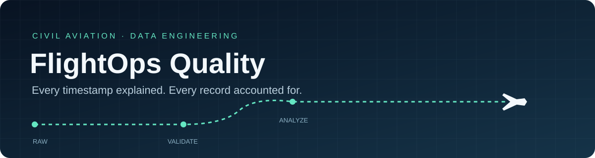
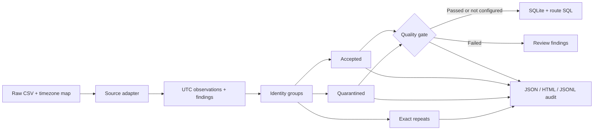

<div align="center">



# FlightOps Quality

**Explainable data quality for civil aviation ETL.**

[](pyproject.toml)
[](LICENSE)
[](https://github.com/ubeydgencer/flightops-quality/releases/tag/v0.2.7)
[](pyproject.toml)

[Quickstart](#quickstart) · [Data contract](#data-contract) · [Quality gates](docs/quality-gates.md) · [Rules](docs/rules.md) · [Security](SECURITY.md) · [Validation](docs/validation.md) · [Türkçe](docs/guide-tr.md)

</div>

Turn local flight clocks and messy source records into UTC observations,
explainable findings and auditable metrics. Designed as a small Python layer
between raw operational data and an analytics warehouse.

> **Batch alpha.** All bundled CSV fixtures are synthetic. Independent project;
> no airline affiliation, production deployment or standards certification.

## What it handles

| Data problem | Package behavior |
|---|---|
| Midnight, timezones and DST | Resolve explicit instants; report gaps/folds; require a policy for scheduled BTS `2400`. |
| Gate versus runway times | Preserve separate block, take-off and landing timestamps and metrics. |
| Cancellation and diversion | Retain the rows and distinguish their expected null arrival fields. |
| Repeated or conflicting records | Audit exact raw repeats; quarantine **every member** of a conflicting identity. |
| Untraceable derived values | Retain raw snapshots, source hashes, row numbers and field-level derivation inputs. |
| Misleading KPI populations | Publish OTP eligibility and exclusions alongside the percentage. |
| Incomplete or heavily quarantined batches | Evaluate caller-chosen coverage, sample-size and quarantine thresholds before warehouse loading. |

Existing airport databases, trajectory tools and schema validators address
related needs. This project explores a narrower operational QA API;
[related work and primary sources](docs/sources.md) explain its position.
Demand and airline adoption have not been established.

## Quickstart

Python 3.9+ is compatible; use a maintained Python version for new environments.

```bash
git clone https://github.com/ubeydgencer/flightops-quality.git
cd flightops-quality
python3 -m venv .venv
source .venv/bin/activate  # Windows: .venv\Scripts\activate
python -m pip install --upgrade pip
python -m pip install .

flightops-quality examples/synthetic_flights.csv --output example-output
python examples/etl_sqlite.py example-output/audit.json example-output/warehouse.db
```

Open `example-output/audit.html`. The synthetic canonical demo has **11 input
records → 6 accepted + 4 quarantined + 1 exact repeat**. Two flights are eligible
for arrival OTP; one is on time. The independent SQL query returns the same 50%.
This tiny fixture demonstrates the policy; it is not an airline performance result.

Use a new output directory for each run. [GitHub releases](https://github.com/ubeydgencer/flightops-quality/releases)
provide wheel and source archives with SHA-256 checksums. **The package is not
published on PyPI.**

### BTS Reporting Carrier CSV

```bash
flightops-quality examples/synthetic_bts.csv --format bts \
  --timezones examples/airport_timezones.json \
  --midnight-policy end --output example-output-bts
```

Supply your own appropriate airport-code → IANA-timezone map. The demo map covers
three airports, and the synthetic midnight row deliberately uses the end of its
service date. Verify that anchor policy for your dated source release; a scheduled
`CRSDepTime=2400` without a `start`/`end` policy is quarantined.

Dates are derived from signed departure delay and elapsed/taxi durations, then
checked against local clocks. A clock alone does not invent an arrival date.
Diverted actual arrivals are not assigned the planned destination timezone.
Raw official airport/carrier IDs remain visible in the audit.

On a system without an IANA database, install `python -m pip install '.[timezone]'`.
Pin Python, the timezone database and the mapping to reproduce historical analysis.

### Dated real-source validation

Offline benchmarks select every January, March or November 2025 BTS source row whose
origin and destination are both JFK, LAX or ORD, retaining all statuses. They
preserve source fields and positions, check archive SHA-256 hashes and separate
source-input KPI parity from held-out reconstruction of arrival delay and
airborne time.

| Dated route cohort | Selected | Accepted unique | Quarantined | Comparable rows per held-out field |
|---|---:|---:|---:|---:|
| [January 2025](docs/bts-2025-01-route-cohort.md) | 2,929 | 2,928 | 1 | 2,909 |
| [March 2025](docs/bts-2025-03-route-cohort.md) | 3,079 | 3,079 | 0 | 3,061 |
| [November 2025](docs/bts-2025-11-route-cohort.md) | 3,246 | 3,245 | 1 | 3,152 |

Both held-out fields match on every comparable row in these runs; cancellations,
diversions, January's clock finding and November's unresolved repeated-hour
anchor have explicit exclusion populations. November's finding is a scheduled
01:20 local LAX clock in the repeated hour; the benchmark leaves its fold
unselected rather than guessing an instant.
March records endpoint-offset changes in 15 scheduled and 18 actual windows;
November records 16 and 14, with different documented populations. These
diagnostics exercise the pinned timezone rules; they do not independently verify
absolute UTC instants or establish that both actual-departure fold choices were
exercised.
The original monthly data and full cohorts are not bundled. Evidence contains
bounded diagnostic examples; these are route-cohort benchmarks, not validation
of every airport or a production feed.

The [November sample report](https://github.com/ubeydgencer/flightops-quality/releases/download/v0.2.4/bts-2025-11-report.html)
and its [recorded JSON](https://github.com/ubeydgencer/flightops-quality/releases/download/v0.2.4/bts-2025-11-route-cohort.json)
are downloadable release assets. The [January report](https://github.com/ubeydgencer/flightops-quality/releases/download/v0.2.2/bts-2025-01-report.html)
and [March report](https://github.com/ubeydgencer/flightops-quality/releases/download/v0.2.3/bts-2025-03-report.html)
retain their original producer metadata. Render the committed November evidence
as an offline HTML report:

```bash
python examples/bts_validation_html.py \
  --input docs/evidence/bts-2025-11-route-cohort.json \
  --output bts-report-2025-11.html
```

Open `bts-report-2025-11.html` in a browser. It is a static report with no
JavaScript or remote fonts. Source/mapping hashes, period, runtime, record dispositions,
held-out comparison counts and exclusions, clock findings and OTP for the source
and accepted populations remain visible together, alongside recorded timezone
offset windows. Rendering stored evidence does not validate a new dataset.
Choose a new output filename; existing files are preserved. A fresh archive-validation run also produces
`validation.html` beside its JSON and extracted cohort.

### Check a batch before warehouse loading

Quality thresholds are optional. This stricter example deliberately **exits 1**
and still writes the audit for review:

```bash
flightops-quality examples/synthetic_flights.csv --output example-output-gated \
  --min-arrival-coverage-percent 80 \
  --min-otp-eligible-flights 10 \
  --max-quarantine-rate-percent 5
```

The synthetic batch has 66.67% arrival coverage (2 of 3 accepted normal flights),
2 OTP-eligible flights and a 40% quarantine rate, so all three configured checks
fail. Arrival coverage measures
whether normal accepted flights have usable arrival-delay data; it is distinct
from the demo's 50% OTP result. These thresholds govern **input quality**, not
flight safety or an airline's on-time performance target.

`audit.json` includes a `quality_gate` with the policy, measurements, checks and
`passed` / `failed` / `not_configured` status. The SQLite example refuses a failed
gate by default. After reviewing the findings, an explicit
`--allow-failed-quality-gate` permits an exploratory load without changing the
record dispositions or gate result. See [quality-gate policy and examples](docs/quality-gates.md).

Before loading, the SQLite example recomputes every accepted, quarantined and
duplicate raw-record SHA-256 using the audit producer's canonical JSON format.
Changed payloads, missing or inconsistent digests and duplicate JSON object keys
are rejected before database creation; the failed-gate override cannot bypass
these checks. This checks internal consistency, not the author's identity or
the original source file. Use audits from your trusted local pipeline.

The loader also reconstructs the recorded summary from normalized timestamps,
status flags and findings in all three dispositions. OTP, arrival coverage,
exclusions, cancellation/diversion rates and finding-occurrence counts must
agree before loading. A passing quality gate does not bypass this check.
Known v0.1 audits without quality gates may omit the two coverage fields that
those versions did not produce; their remaining summary is still checked.

## Data contract

```python
from flightops_quality import analyze_results
from flightops_quality.adapters.canonical import normalize_record
from flightops_quality.reporting import audit_document

record = normalize_record({
    "source": "example", "record_id": "leg-1", "service_date": "2026-10-09",
    "carrier": "DEMO", "flight_number": "101", "origin": "IST", "destination": "FRA",
    "sobt": "2026-10-09T09:00:00+03:00", "sibt": "2026-10-09T11:00:00+02:00",
    "aobt": "2026-10-09T08:55:00+03:00", "aibt": "2026-10-09T11:14:00+02:00",
})
document = audit_document(analyze_results([record]))
assert document["summary"]["arrival_otp_15_completed"]["on_time"] == 1
```

The canonical adapter requires the identity strings shown above and a valid
`YYYY-MM-DD` service date. Timestamps are optional; incomplete normal flights
carry warnings and affected metrics remain null. Optional status flags accept
booleans or `0/1/true/false`; unknown fields remain in the raw snapshot.

| Timestamp | Operational meaning |
|---|---|
| `sobt` / `sibt` | Scheduled off-block / in-block, at the gate |
| `aobt` / `aibt` | Actual off-block / in-block, at the gate |
| `atot` / `aldt` | Actual take-off / landing, at the runway |

Offset-aware ISO values identify the instant directly. Naive ISO values need
`origin_timezone` for `sobt/aobt/atot` and `destination_timezone` for
`sibt/aibt/aldt`; an ambiguous clock also needs `<field>_fold` of 0 or 1.
Invalid ISO offset minutes are rejected rather than normalized.

`flight_metrics(leg)` returns signed gate delays, block, airborne and taxi minutes.
`turnaround_minutes(inbound, outbound)` requires an explicit valid pair: same
known aircraft, matching connecting airport and actual gate times. It does not
infer aircraft connections or impose a universal minimum turnaround.

Use the same policy in a Python pipeline:

```python
from flightops_quality import QualityPolicy, evaluate_quality

report = analyze_results([record])
policy = QualityPolicy(
    min_arrival_coverage_percent=100,
    min_otp_eligible_flights=1,
    max_quarantine_rate_percent=0,
)
gate = evaluate_quality(report, policy)
document = audit_document(report, quality_policy=policy)
assert document["quality_gate"]["status"] == "passed"
```

This reuses the complete single-record example above. Boundary values pass:
minimum coverage/count checks use `>=`, and maximum quarantine rate uses `<=`.
Without configured thresholds, the status is `not_configured`.

## Audit pipeline



Each input record appears once in `accepted`, `quarantined` or `duplicates`.
Accepted records can have warnings. Under `(source, record_id)`, equal raw JSON
payloads are exact repeats; different payloads are conservatively conflicting.
BTS numeric identities normalize integral encodings before grouping, so `0800`
and `800.0` cannot silently count as separate scheduled services.

The CLI writes an input manifest, package/ruleset version, raw-row hashes,
source start-line numbers, normalized values, findings and derivation inputs.
API callers can supply source URLs and configuration in
`audit_document(report, manifest=...)`; the provenance itself is not a complete
environment snapshot.

**`arrival_otp_15_completed`** includes accepted unique, non-cancelled,
non-diverted flights with a valid arrival delay. Delay **<15 minutes** is on time;
exactly 15 is late. Empty denominators return `null`. Cancellation, diversion and
missing data remain visible. This quality-cohort denominator differs from BTS's
published total-operations metric.

## Input boundaries and security

| Input boundary | Default |
|---|---:|
| CSV bytes | 50 MiB |
| Records | 100,000 |
| Records × columns | 2,000,000 cells |
| Columns | 256 |
| Timezone JSON | 1 MiB |
| SQLite example: audit JSON bytes | 128 MiB |
| SQLite example: all audit dispositions combined | 100,000 records |

Raise `--max-input-mb`, `--max-records` or `--max-cells` deliberately for a trusted
batch. Python's CSV field-size limit also applies. The tool keeps a batch in
memory; it is not a distributed or streaming engine.

The SQLite example accepts a regular UTF-8 audit file and checks its actual byte
length before JSON parsing, including trailing whitespace and growth during
reading. Its combined accepted, quarantined and duplicate count is checked
before record verification. Oversized input creates no database; a failed-gate
override cannot bypass the limits. Audit JSON includes normalized records and
metadata, so its size differs from the source CSV. Raise `--max-audit-bytes` and
`--max-records` explicitly for trusted warehouse inputs (Python keywords:
`max_audit_bytes`, `max_records`). Both require positive integers up to `2**63 - 1`.
The bounded document is still parsed in memory; byte limits are not a hard limit
on process memory or concurrent work.

Raw API input is a recursively copied, finite UTF-8 JSON tree with string keys,
32-level nesting and 4096-bit integer limits. Cycles, unpaired surrogates,
nonfinite values and non-JSON objects fail clearly. Direct API integrations must
also bound their overall payload size and record count.

HTML report text is escaped, SQLite values are parameterized, and the core has
no network clients, command execution or mandatory runtime dependencies.
[Security policy and private reporting](SECURITY.md) describe the trust boundary
and review evidence. Checks do not guarantee the absence of vulnerabilities.

CLI exits: **0** after a written report when no configured gate fails, **1** when
a configured quality gate fails or `--fail-on-error` finds quarantined records,
and **2** for malformed files/configuration, including invalid thresholds.
Omitting threshold flags preserves the earlier behavior. A failed quality gate
keeps its audit; invalid input or policy creates no partial audit. Existing output
folders are preserved.

On macOS/Linux, atomic directory publication uses exclusive-rename APIs. Windows
uses Python's no-replacement rename behavior but has not been verified. Other
unsupported platforms fail without publishing a partial audit.

## Development

```bash
python -m pip install -e '.[dev,security]'
python -m unittest discover -s tests -v
ruff check .
bandit -r src examples
python -m build
python -m twine check dist/*
```

[Versioned validation](docs/validation.md) records unit, integration, clean-wheel
and security checks. Hosted CI is currently blocked by GitHub integration
permissions; [the reference workflow](docs/ci.yml) is ready, and no passing hosted
CI badge is claimed.

[Design and roadmap](docs/design.md) · [Quality-gate policy](docs/quality-gates.md) · [Rule catalog](docs/rules.md) ·
[Contributing](CONTRIBUTING.md) · [Changelog](CHANGELOG.md) ·
[Turkish usage guide](docs/guide-tr.md)

The MIT license covers this project's code and original synthetic fixtures.
Upstream data and specifications retain their own terms. Broader validation
across airports, periods and consumer feeds remains a next step, alongside
feedback on optional columnar exports and provider schemas.
